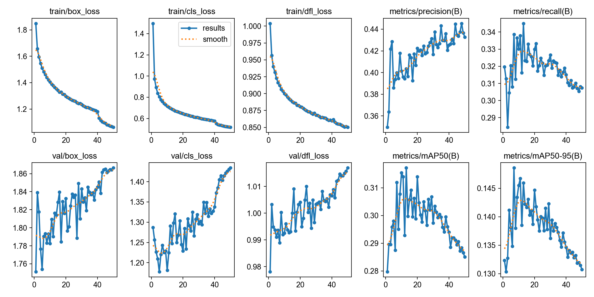
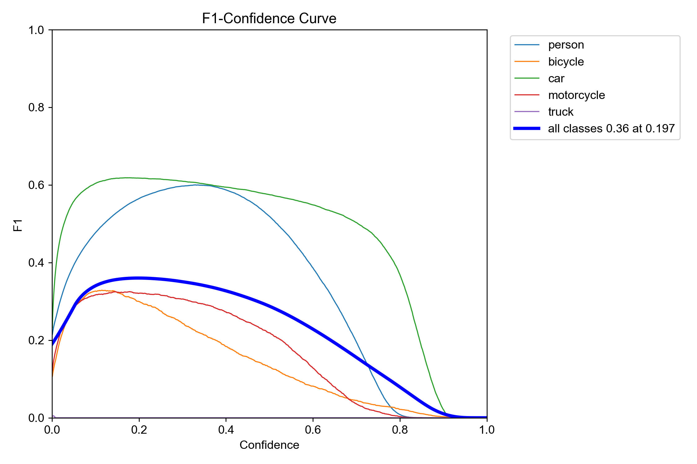
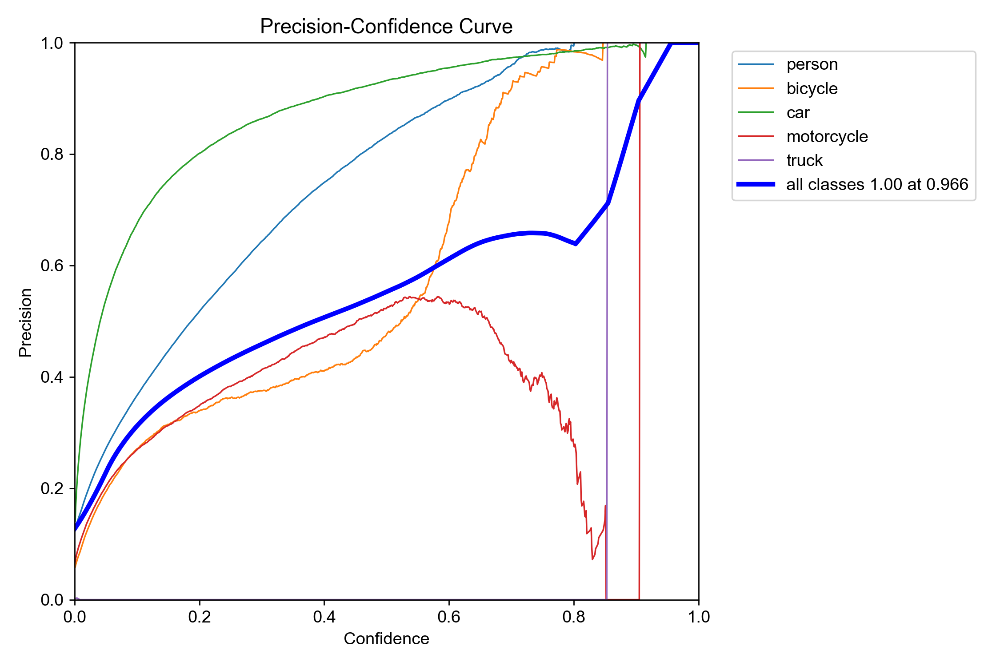
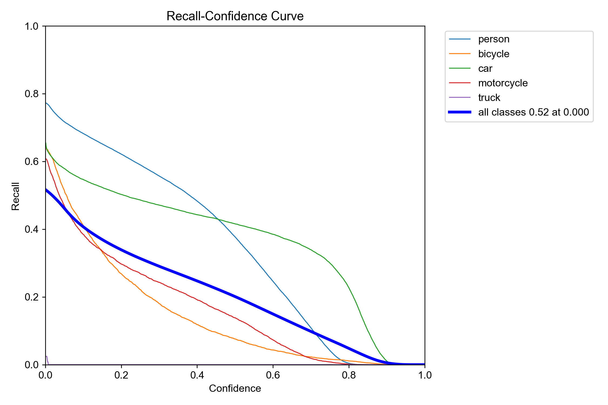
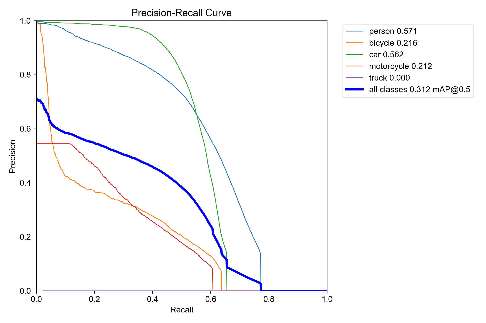
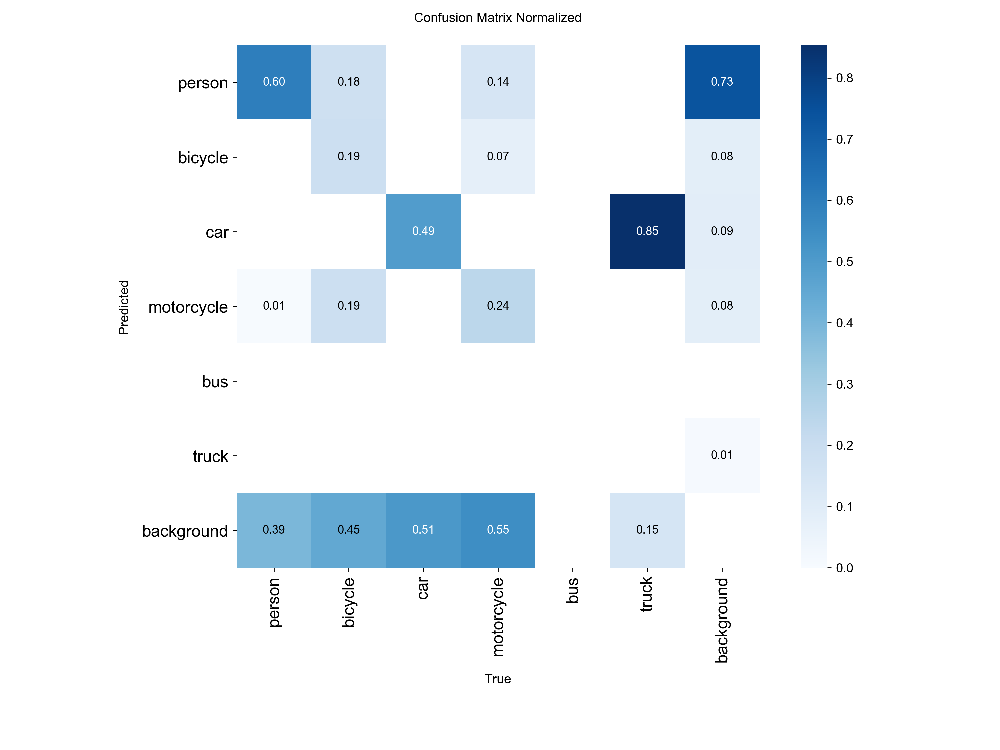

# YOLOv8n VisDrone Finetuning — Analysis

## Overview

This document covers the full evaluation and finetuning analysis of YOLOv8n on the VisDrone2019-VID dataset for the UAV autonomous tracking project. The goal was to improve detection of small aerial objects over the baseline COCO-pretrained model.

---

## Dataset

| Split | Source | Sequences | Frames |
|---|---|---|---|
| Train | VisDrone2019-VID-train | 56 | ~24,201 |
| Val | VisDrone2019-VID-val | 7 | ~1,861 images after conversion |
| Test | VisDrone2019-VID-test-dev | 18 | used for final eval only |

**Class distribution in training data:**

| Class | Instances |
|---|---|
| person | 192,483 |
| car | 248,179 |
| motorcycle | 43,973 |
| bicycle | 28,188 |
| truck | 2,897 |
| bus | 0 |

Key observation: truck and bus are severely underrepresented. Bus is completely absent from training data.

**Box size distribution:** Objects are extremely small — width/height clustered at 0.02–0.05 normalized units. This is the core challenge of aerial detection and the primary reason standard COCO-trained models underperform on VisDrone.

---

## Training Configuration

| Parameter | Value |
|---|---|
| Base model | yolov8n.pt (COCO pretrained) |
| Epochs | 50 |
| Batch size | 16 |
| Image size | 640 |
| Learning rate | 0.01 |
| Patience | 50 |
| Device | Apple M3 Pro (MPS) |
| Training time | 48.3 hours |
| Best epoch | 7 |

---

## Training Curves Analysis

### Train vs Val Loss Divergence



The training curves reveal **classic overfitting**:

- **Train losses** (box, cls, dfl) — all three drop consistently across all 50 epochs 
- **Val losses** — all three **increase** after epoch 7 

```
Train loss ↓ + Val loss ↑ = model memorising training data, not generalising
```

Best weights were saved at epoch 7 (mAP50=0.312), after which val performance degraded despite train loss continuing to improve. This is why `best.pt` ≠ `last.pt`.

**Root cause:** Insufficient dataset diversity. 56 sequences is not enough variety for YOLOv8n to generalise without overfitting. More data or stronger augmentation (mosaic, mixup, random affine) would push the best epoch later.

---

## Curve Analysis

### F1-Confidence Curve



- All classes peak at **F1=0.36 at conf=0.197**
- Person has a wide, flat F1 peak between conf=0.2–0.5 — robust across a range
- Car peaks later (~0.4) with strong F1 — reliable high-confidence detections
- Bicycle and motorcycle peak early and drop sharply — weak, uncertain classes
- Truck flatlines at F1≈0 — model completely failed to learn this class
- **Confirms conf=0.25 is the optimal threshold**

### Precision-Confidence Curve



- Person and car both reach 0.95+ precision at high confidence
- Motorcycle/bicycle max out at ~0.5 precision — model is uncertain
- Sharp precision jump above conf=0.85 = model only predicting when very sure
- At conf=0.6 (original C++ app threshold): precision is high but recall collapses

### Recall-Confidence Curve 



- Person recall starts at **0.77 at conf=0** — model finds most persons even at low confidence
- Car recall starts at 0.64, stays high until conf=0.5
- Bicycle/motorcycle recall drops immediately — poor detection even at low conf
- **Person and car are the only classes with usable recall curves**

### Precision-Recall Curve



| Class | AP@0.5 |
|---|---|
| person | 0.571 |
| car | 0.562 |
| motorcycle | 0.212 |
| bicycle | 0.216 |
| truck | 0.000 |
| **all** | **0.312** |

Person and car curves have large area underneath- these are the only two classes worth targeting.

---

## Confusion Matrix Analysis 



| True \ Predicted | person | bicycle | car | motorcycle | background |
|---|---|---|---|---|---|
| person | **0.60** | — | — | — | 0.39 |
| bicycle | 0.18 | **0.19** | — | 0.07 | 0.45 |
| car | — | — | **0.49** | — | 0.09 |
| motorcycle | 0.01 | 0.19 | 0.14 | **0.24** | 0.55 |
| truck | — | — | 0.85 | — | 0.15 |

**Key findings:**

- **Person:** 60% correctly detected, 39% missed as background — recall bottleneck
- **Car:** 49% correctly detected, truck gets absorbed into car (0.85) — truck effectively invisible
- **Motorcycle:** Only 24% correct, heavily confused with bicycle and background — unreliable class
- **Background miss rate is the dominant failure mode** — 39% person, 51% car, 55% motorcycle all classified as background
- This high background miss rate directly explains the low recall values across all runs

---

## Evaluation Results — Test Matrix

All evaluations run on `VisDrone2019-VID-test-dev` (18 sequences).

### Baseline vs Finetuned (conf=0.25, iou=0.5)

<table>
  <tr>
    <td>
      
    </td>
    <td>
      
    </td>
  </tr>
</table>

| Model | Precision | Recall | F1 |
|---|---|---|---|
| Baseline yolov8n.pt (COCO) | 0.679 | 0.237 | 0.351 |
| Finetuned best.pt | 0.565 | 0.401 | **0.469** |

Finetuning improved F1 by **+34%** and recall by **+69%**.

### Full Parameter Matrix (Finetuned best.pt)


| conf | iou | Precision | Recall | F1 | Notes |
|---|---|---|---|---|---|
| 0.25 | 0.5 | 0.565 | 0.401 | 0.469 | Standard |
| 0.60 | 0.5 | 0.867 | 0.230 | 0.363 | Matches original C++ app |
| 0.25 | 0.3 | 0.643 | 0.456 | **0.533** | **Best F1** |
| 0.15 | 0.3 | 0.506 | 0.527 | 0.516 | Too many FP |
| 0.60 | 0.3 | 0.895 | 0.237 | 0.375 | High precision, low recall |

---

## Optimal Thresholds for UAV Datasets

| Parameter | Standard COCO | UAV/Aerial (VisDrone) | This Project |
|---|---|---|---|
| conf | 0.5 | 0.25–0.35 | **0.25** |
| eval iou | 0.5 | 0.25–0.4 | **0.3** |
| nmsThreshold | 0.45 | 0.45 | **0.45** |

---

## Comparison with other datasets

| Dataset | Size | Altitude | Classes | Quality | Availability |
|---|---|---|---|---|---|
| VisDrone | ~24k frames | 5–120m | 10 | Good | Free |
| UAVDT | ~80k frames | Low (15-50m) | 3 (car only) | Good | Free |
| AU-AIR | ~32k frames | Mixed | 8 | Good | Free |
| MOT17/20 | Large | Ground level | Person only | Excellent | Free |
| HERIDAL | Small | High alt | Person | Good | Free |
| SARD | Small | High alt | Person | Good | Free |

---

## Limitations of Current Model

1. **Overfitting at epoch 7** — val loss diverges from train loss early, suggesting more diverse data is needed
2. **High background miss rate** — 39–55% of objects across classes missed as background
3. **Small object challenge** — objects at 0.02–0.05 normalized size are at the edge of YOLOv8n's detection capability
4. **YOLOv8n capacity** — the nano model has limited representational power; YOLOv8s/m would improve results at cost of inference speed

---

